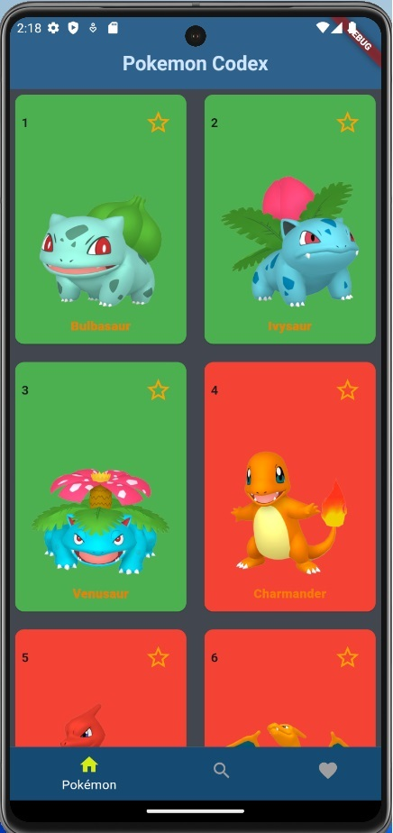
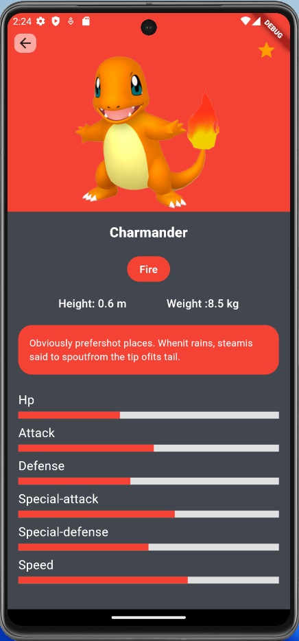
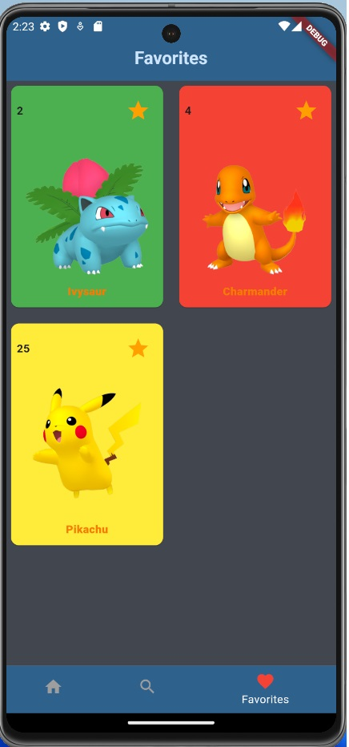
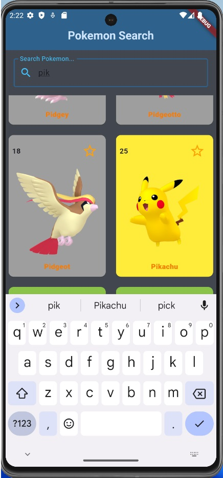

# My First Flutter Application

This is my first Flutter application. It uses the [PokeAPI](https://pokeapi.co/) to fetch all Pokémon and displays each of them in a card. You can navigate from the cards to a details page where more information about each Pokémon is displayed. Pokémon can be added to favorites. The application also features a dynamic search function. I also added an Overview page, which also included a navigation and you can look at pokemons based on generations or types

## Screenshots

